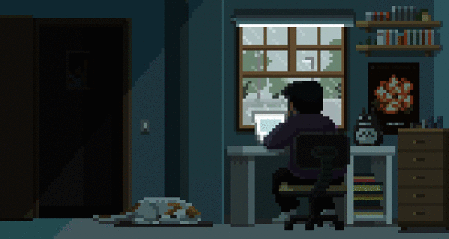

  

Informatics Engineering student at Universitas Lampung and an aspiring Full-Stack Web Developer. Dedicated to building efficient web applications using Laravel and React.js, while actively expanding skills in Network Security, systems administration, and IoT solutions.

 

<h3 align="left">🚀 Current Focus</h3>

  🔭 <b>Currently working on:</b> <a href="https://github.com/nuzaimbirri/INSPECTRUST">INSPECTRUST</a> (K3 Inspection System)  
  🌱 <b>Currently learning:</b> React.js, Laravel Ecosystem & Network Security  
  💬 <b>Ask me about:</b> Web Development, IoT, or Database Management  

###

<h3 align="center">🛠️ Tech Stack & Tools</h3>

   
  <strong>🌐 Frontend:</strong>  
   
   
   
   
  
  
    
  <strong>⚙️ Backend & Database:</strong>  
   
   
   
  
  
    
  <strong>🎨 Tools & Design:</strong>  
   
   
  

###

  
  
  
  
  

###

<h3 align="center">📊 GitHub Statistics</h3>

  
  

 

  
  

###

<picture data-importer="pacman">
  <source media="(prefers-color-scheme: dark)" srcset="https://raw.githubusercontent.com/nuzaimbirri/nuzaimbirri/pacman-output/pacman-contribution-graph-dark.svg?game=pacman">
  <source media="(prefers-color-scheme: light)" srcset="https://raw.githubusercontent.com/nuzaimbirri/nuzaimbirri/pacman-output/pacman-contribution-graph.svg?game=pacman">
  
</picture>

###

###